Primer punto: se selecciona la imagen del SO a instalar
 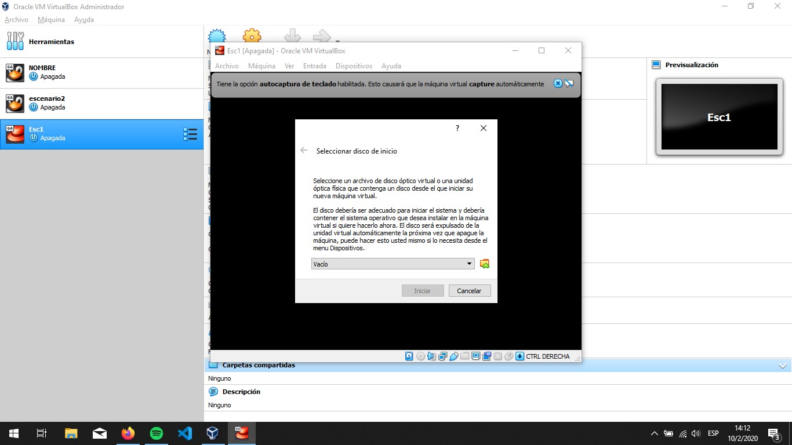

Luego se selecciona la opción de instalar centos8
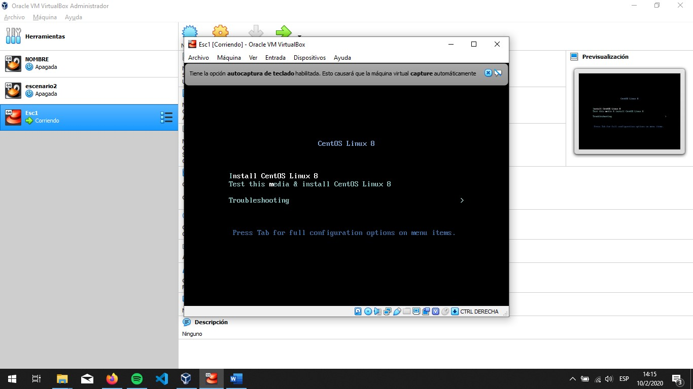
 
Luego mestra una interfaz grafica que nos permite configurar nuestra maquina virtual.
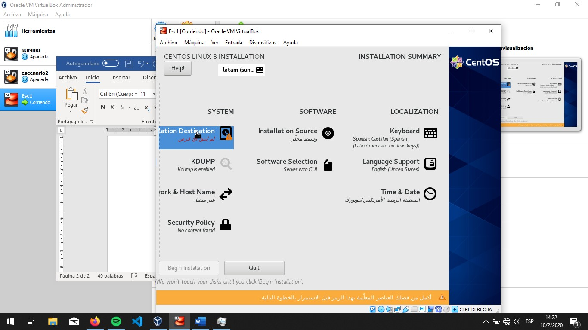
 
 De manera predeterminada lo que falta es asignar el disco a lo cual lo seleccionamos mediante la interfaz grafica. 
 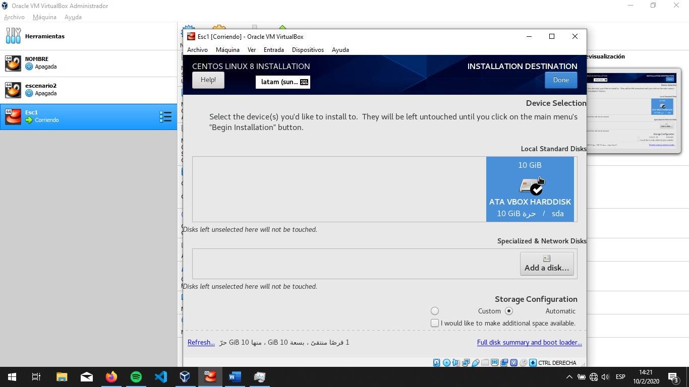
 
Seguido a este paso procedemos a la instalación
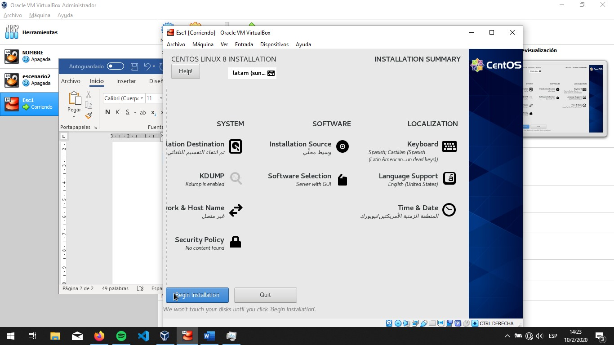
 
En la siguiente pantalla se puede configurar parámetros de usuarios como la contraseña del super usuario y usuarios
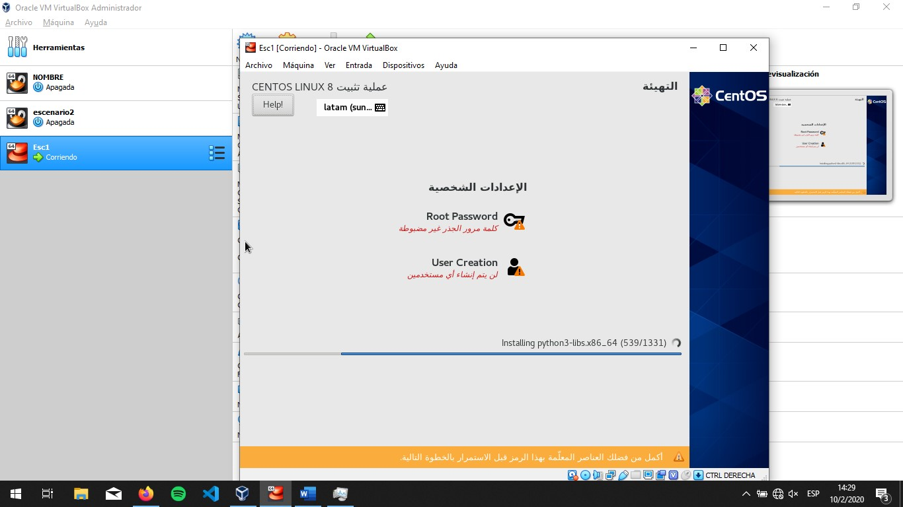
 
Finalmente se reinicia la maquina virtual
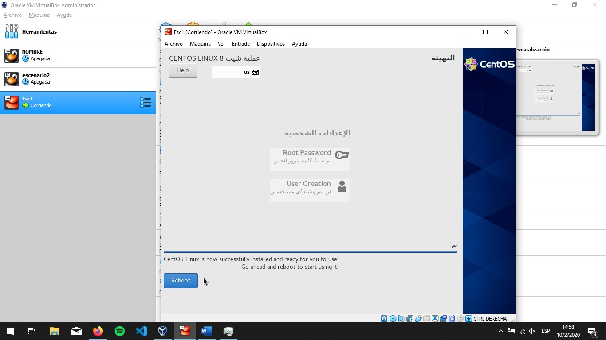
 
En caso de no iniciar con la imagen de centos al momento de inicar la maquina presional F12 y seleccionar la opción Hard Disk 
 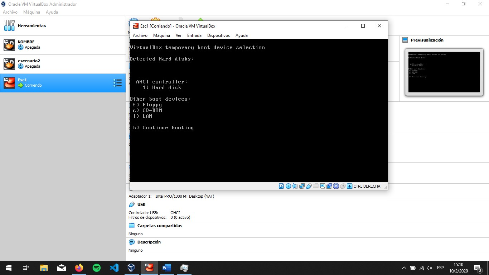
 
Y aceptar los términos y condiciones
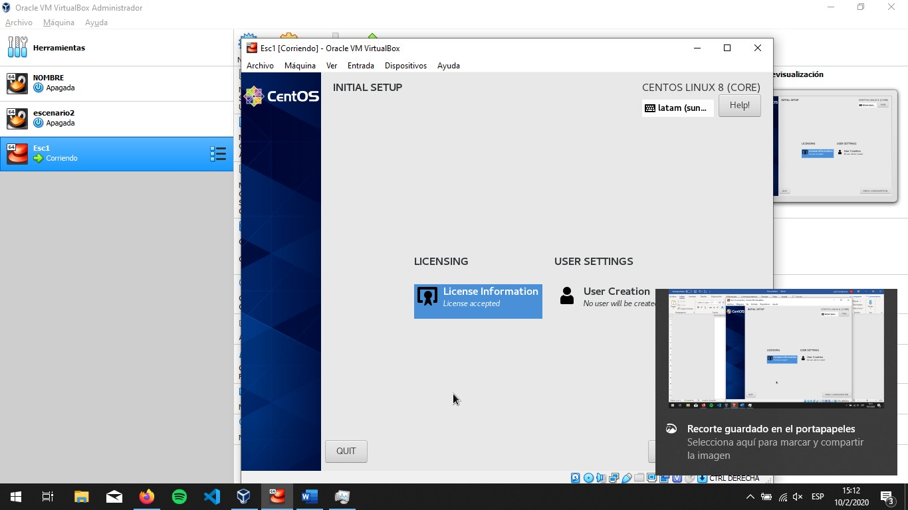
 
Ya en centos se procede a actualizar e instalar Nginx
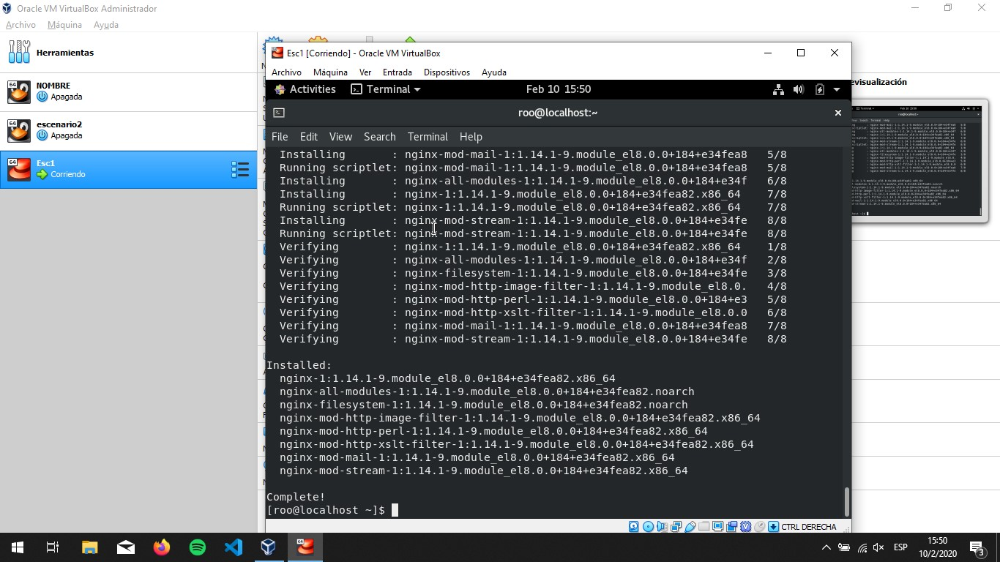
 
Y levantar su servicios
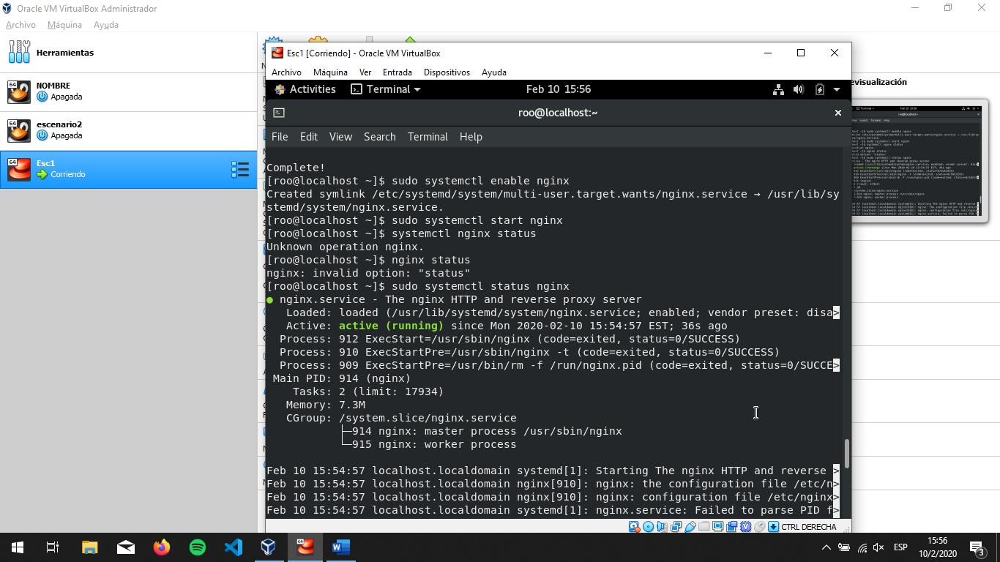

Luego para acceder a los servicios se deben cambiar unos parámetros en la aplicación de vrtual box en la configuración de red conectarlo a “solo anfrition”
 

Para finalmente acceder a la pagina mediante otro equipo
 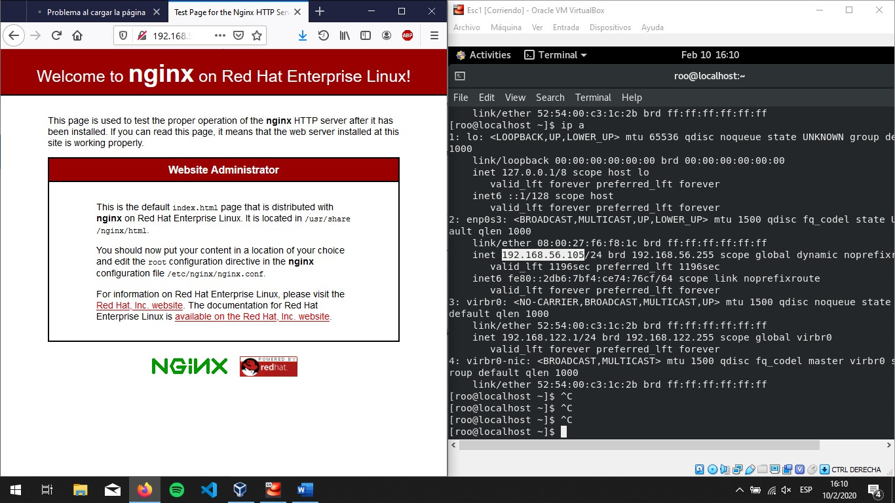

Como se pudo observar el método de montar un servicio es bastante tedioso debido a que se tiene que configurar toda la máquina virtual además que en alguno de estos pasos pueden surgir errores por tanto no es la manera mas optima para montar un servicio distribuido. Lo anterior debido a que, de ser asi, se gastarían recursos innecesarios de tiempo y dinero montando servidores de esta manera además de estas virtualizaciones pueden ser objetivo para otros fines por fuera de los creados por tanto son mas inseguros.
